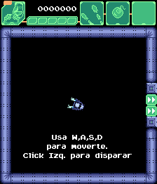

# Hahaiwoo
 </img>
 </img>
 </img>

Presentamos un juego de estilo Top-Down bullet hell, en el que te pones al mando de una nave espacial y te enfrentas a la frenética acción de escapar de un laberinto alienígena. Es importante destacar que este juego es simplemente una prueba de concepto, por lo que algunas características aún no han sido implementadas. Originalmente desarrollado como parte de una diplomatura de videojuegos, ahora está disponible como proyecto de código abierto con fines didácticos, permitiendo a los interesados explorar su estructura y contribuir a su desarrollo.

## Play now!
Puedes probar este juego desde este [enlace](https://andrestapa.itch.io/hahaiwoo)

## Edit Game
Puedes editar este juego con [Godot 4.x.x](https://godotengine.org).
